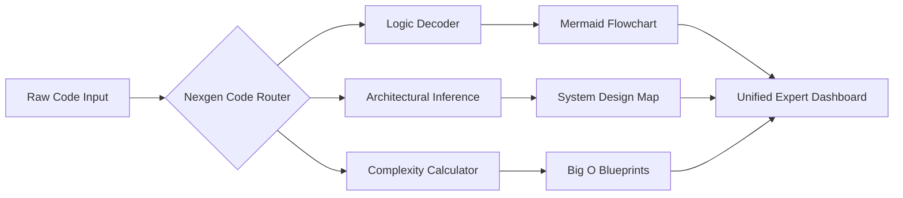

# 🌌 Nexgen Code: The Architectural Code Intelligence Engine

<p align="center">
  
</p>

> **"Unraveling complexity, one line of code at a time."**  
> Nexgen Code is a next-generation AI orchestrator that deconstructs complex codebases into interactive architectural blueprints, enterprise-grade documentation, and deep algorithmic insights.

<p align="center">
  
  
  
  
</p>

---

## 📽️ Visualizing the Future of Development

Imagine pasting a 1000-line legacy script and instantly seeing a **high-fidelity system design map**. That's Nexgen Code. It bridges the gap between raw syntax and human understanding.

### 🌟 High-Definition Features

#### 📊 **Neural Flowcharting**
*   **Dynamic Rendering**: Code is instantly mapped into high-contrast Mermaid.js diagrams.
*   **Logical Subgraphs**: Automatically identifies and groups related logic blocks (e.g., Auth, Database, UI Logic).
*   **Flowing Paths**: Animated edges represent data movement through the system.

#### 🏗️ **Expert Infrastructure Mapping**
*   **Zero-Guess Architecture**: Infers backend services (Lambda, S3, Redis, SQL) directly from your code's intent.
*   **Relationship Modeling**: Understand how your modules talk to external APIs and services.

#### 📈 **Deep Complexity Blueprints**
*   **Big O Scoring**: Instant calculation of Time and Space complexity.
*   **Maintainability Index**: Qualitative scoring based on cognitive load and cyclomatic complexity.
*   **Optimization Tips**: AI-driven suggestions to refactor bottlenecks.

#### 🌍 **Native Multilingual Sync**
*   Read explanations in **English, Hindi, or Hinglish**.
*   Perfect for global teams and students who prefer contextual learning.

---

## 🧠 How It Works

Nexgen Code uses a proprietary orchestration layer to process code through multiple specialized AI agents:



---

## 🛠️ Technical Masterstack

### **Frontend Architecture**
- **Framework**: React 18 (Hooks, Context API)
- **Bundler**: Vite (Lightning fast HMR)
- **Styling**: Tailwind CSS + Custom Obsidian Glassmorphism
- **Animations**: Framer Motion (60FPS transitions)
- **Editor**: Microsoft Monaco Editor
- **Visualization**: Mermaid.js + Custom SVG injection

### **Backend Intelligence**
- **Core**: FastAPI (Asynchronous Python)
- **LLM Orchestration**: Groq Llama-3-70B & Gemini 1.5 Flash
- **API Management**: Multi-key rotation system for zero-downtime inference
- **Parsing**: Advanced regex and AST-based logic extraction

---

## 🚀 Installation & Setup

### **Backend Deployment**
1.  **Clone & Enter**:
    ```bash
    git clone https://github.com/your-username/Nexgen-code.git
    cd Nexgen-code/backend
    ```
2.  **Environment Sync**:
    Create `.env` and add your keys:
    ```env
    GROQ_API_KEY=your_key_1,your_key_2
    DEEPSEEK_API_KEY=optional
    ```
3.  **Run Engine**:
    ```bash
    pip install -r requirements.txt
    uvicorn main:app --reload
    ```

### **Frontend Launch**
1.  **Dependencies**:
    ```bash
    cd ../frontend
    npm install
    ```
2.  **Go Live**:
    ```bash
    npm run dev
    ```

---

## 🗺️ Roadmap & Future Vision

- [ ] **Real-time Terminal Streaming**: Watch the AI "think" in a live log panel.
- [ ] **Repo-wide Scanning**: Upload an entire ZIP and map the whole project.
- [ ] **Collaborative Links**: Share a unique URL for your generated blueprints.
- [ ] **Git Integration**: Directly pull from any public GitHub URL.

---

## 🤝 Community & Support

Nexgen Code is built for the developer community. If you find it useful, give it a ⭐ and help us build the ultimate architectural tool!

- **Creator**: [Your Name/Handle]
- **Status**: Production Ready v2.0
- **Support**: Open an Issue for bugs or feature requests.

---

<p align="center">
  
  <i>Built with ❤️ for the next generation of Software Architects.</i>
</p>
